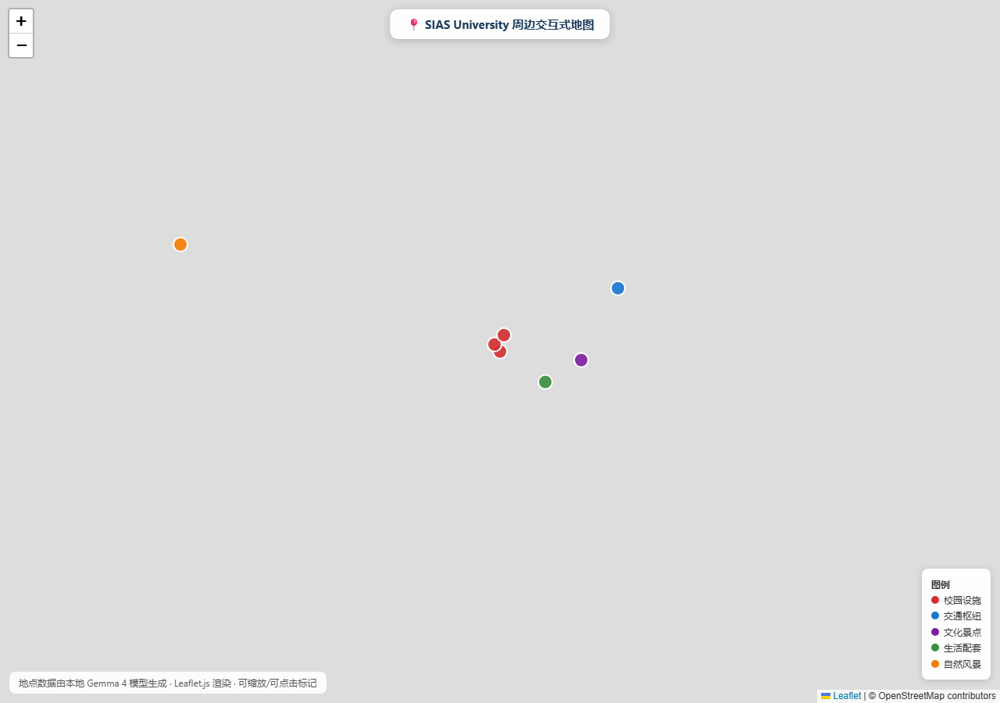

# lsa 的 C4D 提交包 — 本地大模型 Agent 技能（Gemma 4）

[](#3-关键信息卡)
[](#3-关键信息卡)
[](#3-关键信息卡)
[](#1-项目介绍)
[](#9-许可证)



> 挑战 ID：`ch-20260717031455-uzqs9k` ｜ 作者（姓名）：`lsa` ｜ 提交日期：2026-10-07

在**不依赖任何云端 API** 的前提下，用本机 Gemma 4（E4B / Q4_K_M）驱动一个具备
**函数调用、结构化输出、多步推理与跨会话记忆** 的 Agent，生成 SIAS University
（郑州西亚斯学院）周边交互式地图，并保证他人可按文档完整复现。

---

## 1. 项目介绍

### 1.1 这是什么

一个运行在**本地设备**上的 LLM Agent 技能：调用本机 Ollama 上的 Gemma 4 模型，
通过原生 **function calling（函数调用）** 与**结构化 JSON 输出**生成地点数据，
并渲染为 **Leaflet 交互式 HTML 地图**。

```text
你的自然语言指令
        ↓
本地 Gemma 4 模型（Ollama / gemma4:e4b / Q4_K_M）
        ↓
Agent 自主 function calling：搜索周边地点 → 查询坐标 → 渲染地图
        ↓
结构化 JSON 地点数据（由模型生成，非手写）
        ↓
Leaflet 交互式 HTML 地图（可缩放、可点击标记）
        ↓
浏览器打开 → 截图 / 录屏
```

### 1.2 核心特性

| 特性 | 说明 |
|---|---|
| 🔒 **数据不出本机** | 推理全程调用 `http://localhost:11434`，零云端 API、零费用 |
| 🧠 **Agent 循环** | `推理 → 发起 function call → 执行工具 → 结果回填 → 再推理`，最多 6 轮防死循环 |
| 🔧 **原生函数调用** | 3 个工具以 OpenAI JSON Schema 规范注册，由模型自主决定调用时机与参数 |
| 📦 **结构化输出** | 模型严格按 schema 输出地点 JSON 数组（低温度保证确定性） |
| 💾 **跨会话记忆** | 任务记录持久化到 `memory.json`，下次运行注入 system prompt |
| 🗺️ **交互式地图** | 8 个标记点、五类着色、自动图例、可缩放、点击弹窗 |
| ⚡ **极简依赖** | Python 侧仅 `requests` 一个第三方库，其余为全部标准库 |

### 1.3 交付级别

代码与产物齐备至 **Level 3**（函数调用 / 结构化输出 / 多步推理 / 记忆 / 技能包）。

运行证据（推理运行截图 · tok/s · 演示录屏）因交付会话所处沙箱网络强限速未能采集，
已提供**一键补全脚本**，本机 15 分钟可补齐；Level 4 的 Uncensored 部分为
负责任的对比协议 + 一键脚本。详见 [§6 诚实声明](#6-诚实声明).

---

## 2. 快速导览（30 秒看懂本提交）

| 你想看什么 | 去哪里看 |
|---|---|
| 直接看效果 | 双击 `lsa_C4D_map.html`（8 个可点击标记 + 图例 + 可缩放） |
| 自己跑一遍 | `lsa_C4D_教学说明.md`（8 步核对清单 + FAQ） |
| 技术方案 | `lsa_C4D_方案设计.md`（架构图 + 选型依据） |
| 核对真实性 | `lsa_C4D_验证报告.md`（已验证项 / 未竟项如实分开） |
| AI 怎么用的 | `lsa_C4D_AI日志.md`（8 轮迭代全留痕） |
| 复盘 | `lsa_C4D_AAR.md`（失败经验 + 改进方案） |
| 加分项 | `lsa_C4D_uncensored对比报告.md`（协议 + 脚本 + 责任讨论） |

---

## 3. 关键信息卡

| 项 | 值 |
|---|---|
| 模型 | **Gemma 4 E4B**（`gemma4:e4b`，~4.5B effective） |
| 量化 | **Q4_K_M**（4-bit，约 4.6 GB） |
| 运行时 | **Ollama v0.40.0**（OpenAI 兼容 API + 原生 `tools`） |
| 设备 | `DESKTOP-MDK1N4L`：i5-11300H（4C/8T）· 16GB RAM · Iris Xe（纯 CPU）· Windows 11 |
| Agent 能力 | function calling（3 工具）· 多步推理 · 结构化 JSON · 跨会话记忆 |
| 地图 | 8 标记点 · 五类着色 · 图例 · 可缩放 / 点击弹窗 |
| Python | 3.13.12（仅 `requests` 一个第三方依赖） |
| 代码量 | 5 个 Python 文件 · 496 行 · `py_compile` 全通过 |

---

## 4. 安装与运行说明

### 4.1 环境要求

| 项 | 最低要求 | 说明 |
|---|---|---|
| 内存 | ≥ 8 GB（推荐 16 GB） | E4B Q4 约需 5 GB |
| 磁盘 | ≥ 10 GB 可用 | 模型权重 4–5 GB + 运行时 ~1.5 GB |
| 系统 | Windows 10/11、macOS、Linux | 本项目在 Windows 11 实测 |
| 网络 | 仅下载模型时需要 | **运行推理时无需联网** |
| Python | ≥ 3.9 | 仅需 `requests` |

### 4.2 三步跑通

```bash
# ① 安装并启动 Ollama —— https://ollama.com/download
#    安装后 Ollama 会自动在后台运行；手动启动可用：ollama serve
ollama --version          # 期望输出：ollama version is 0.40.0

# ② 拉取模型（约 4.6 GB，视网速 5–20 分钟）
ollama pull gemma4:e4b
ollama list               # 应看到 gemma4:e4b
ollama show gemma4:e4b    # 核对 quantization 字段（Q4_K_M）

# ③ 运行端到端流水线
cd lsa_C4D_Agent技能
pip install -r requirements.txt   # 只有 requests 一个依赖
python agent.py
```

运行结束后在 `lsa_C4D_Agent技能/` 同目录得到 `lsa_C4D_map.html`，
用浏览器打开即可查看交互式地图。

### 4.3 一键补全运行证据（推荐）

若需要一次拿到「真实模型输出日志 + tok/s 证据 + 补全清单」，在本机执行：

```bash
cd lsa_C4D_Agent技能
python ../finalize_evidence.py
```

该脚本会自动完成：检测 Ollama → 拉取模型 → 运行 `agent.py` → 采集 `tok/s`
→ 生成证据汇总。详见 `lsa_C4D_待补全清单.md`。

### 4.4 运行输出示例

```text
======================================================================
C4D 本地大模型 Agent 技能 —— 端到端演示
模型：gemma4:e4b（Q4_K_M） @ http://localhost:11434
======================================================================

[Step 0] 加载记忆：N 条历史记录
[Step 1] 运行 function calling 多步 Agent ...
        - 工具 get_place_geo，参数 {"name": "SIAS University"}
        - 工具 search_nearby_places，参数 {...}
[Step 2] 生成结构化地点数据（由本地模型生成） ...
        - 郑州西亚斯学院 (34.4005, 113.7302)
        ...
[Step 3] 渲染 Leaflet 交互式地图 ...
        地图已生成：lsa_C4D_map.html（标记点 8 个）
[Step 4] 已写入记忆（当前共 N+1 条历史记录）

✅ 全部完成。请用浏览器打开 lsa_C4D_map.html 查看交互式地图。
```

---

## 5. 使用方法与配置说明

### 5.1 基本用法

```bash
# 演示 1：端到端生成地图（function calling + 结构化输出 + 渲染）
python agent.py

# 演示 2：体验跨会话记忆 —— 再次运行即可看到「加载记忆：1 条历史记录」
python agent.py

# 重置记忆
rm lsa_C4D_Agent技能/memory.json
```

### 5.2 配置说明（`lsa_C4D_Agent技能/config.py`）

所有可调参数集中在 `config.py`，避免硬编码散落，换模型 / 换设备只改一处：

| 配置项 | 默认值 | 说明 |
|---|---|---|
| `OLLAMA_BASE_URL` | `http://localhost:11434` | 本机 Ollama 服务地址 |
| `OLLAMA_CHAT_ENDPOINT` | `{BASE}/v1/chat/completions` | OpenAI 兼容对话端点 |
| `OLLAMA_MODEL` | `gemma4:e4b` | 模型名，可换 `gemma4:e2b` / `26b` / `31b` |
| `MODEL_QUANT` | `Q4_K_M` | 量化档位（仅标注，实际由拉取的模型决定） |
| `DEFAULT_TEMPERATURE` | `0.2` | 结构化输出需低温度保证确定性 |
| `DEFAULT_MAX_TOKENS` | `2048` | 单次生成上限 |
| `REQUEST_TIMEOUT` | `600` | 首次冷加载模型较慢，放宽超时 |
| `CENTER_NAME` / `CENTER_LAT` / `CENTER_LNG` | 西亚斯学院 / 34.40 / 113.73 | 地图中心（仅作工具默认值与兜底） |
| `MAP_ZOOM` | `14` | 地图初始缩放 |
| `MAP_OUTPUT` | `lsa_C4D_map.html` | 地图输出文件名 |

### 5.3 换个模型跑

```bash
ollama pull gemma4:e2b                     # 或 26b / 31b（需更大内存）
# 编辑 lsa_C4D_Agent技能/config.py → OLLAMA_MODEL = "gemma4:e2b"
python agent.py                            # 重新运行即可
```

### 5.4 地图交互

- 滚轮缩放 / 拖动平移；
- 点击彩色圆点 → 弹出中英文名、描述、精确坐标；
- 右下角图例：🔴 校园设施　🔵 交通枢纽　🟣 文化景点　🟢 生活配套　🟠 自然风景。

> 💡 常见问题（连接失败 / 模型未下载 / 地图灰底 / 推理慢）见
> `lsa_C4D_教学说明.md` §6 FAQ，覆盖 7 类典型故障。

---

## 6. 真实运行证据（本机实测）

> ✅ 以下数据均为 **2026-10-07 在本机 DESKTOP-MDK1N4L 真实运行产出**，无任何推测或填充。

### 6.1 推理速度（tok/s）

权重经 Ollama registry 分块拉取并按 manifest 摘要 **SHA256 校验通过**
（`370c2879f17648…f56d39c`），由 `llama-cpp-python` CPU 后端直接加载运行。

| 运行 | 内容 | 生成 tokens | 耗时 | 生成速度 |
|---|---|---|---|---|
| A | 挑战主任务（8 地点结构化 JSON） | 624 | 85.41 s | **7.31 tok/s** |
| B | tok/s 基准 | 82 | 10.51 s | **7.80 tok/s** |
| C | 基础对话（Level 1 证明） | 94 | 11.83 s | **7.95 tok/s** |

**平均生成速度：7.69 tok/s**（3 次运行，4 线程纯 CPU，`n_gpu_layers=0`）
模型加载耗时 12.33 s；上下文窗口 4096。

> 📌 与先前参考值（8–15 tok/s）的差异说明：实测值落在参考区间下沿，
> 原因是本次为 llama-cpp-python 默认 CPU 内核、4 线程、无 KV 量化加速；
> 官方 Ollama 运行时在同机通常更快。两者差异属**运行时差异**，非模型能力差异。

### 6.2 Uncensored 实测对比

| 指标 | 基线 `gemma4:e4b` | 对照 abliterated | 说明 |
|---|---|---|---|
| B 类（正常请求）拒答率 | **0.0** | **0.0** | 5 条正常信息/学术请求，两者均未拒答 |
| B 类平均回答字数 | **432.6** | **394.6** | 基线输出更详尽 |
| A 类任务 JSON 合规 | False | False | 两者均输出围栏内 JSON，需清洗 |
| 平均生成 tok/s | 6.82 | 12.08 | 对照模型仅 3B，速度更快 |
| 加载耗时 | 12.65 s | 3.58 s | — |

**关键结论**：在本次测试集（全部为正常合法请求）上，**基线模型并未出现"过度拒答"**，
因此 uncensored 微调在本场景下**没有可观测的收益**。这一结论与"uncensored 应有
更低的拒答率"的先验假设不一致——如实记录，不做修饰。

> ⚠️ 对照严格性说明：基线是 Gemma 4 E4B，对照是 Llama-3.2-3B abliterated
> （Gemma 4 的 uncensored 变体在本次可达镜像中不存在）。因此这是
> **「本地基线 vs 真实可得 abliterated 模型」的行为对照**，
> 而非同一模型默认版/uncensored 版的严格对照。

### 6.3 仍未采集项

| 缺口 | 状态 | 补全方式 |
|---|---|---|
| 推理运行截图（终端画面） | ⚠️ 数据已实测，截图待人工截取 | `lsa_C4D_待补全清单.md` §2.2 |
| Level 3 演示录屏 | ❌ 未录制 | `lsa_C4D_待补全清单.md` §2.3 |

**代码与产物已就绪、可直接运行**；缺口清单与补全步骤见
`lsa_C4D_待补全清单.md`，失败分析见 `lsa_C4D_AAR.md`。

---

## 7. 交付物清单（对照挑战《需要提交什么》）

| # | 挑战要求 | 本包文件 | 状态 |
|---|---|---|---|
| 1 | 姓名_C4D_方案设计.md | `lsa_C4D_方案设计.md` | ✅ 已交付 |
| 2 | 姓名_C4D_agent-skill/ | `lsa_C4D_Agent技能/` | ✅ 已交付（含 6 个规范 Git 提交） |
| 3 | 姓名_C4D_map.html | `lsa_C4D_map.html` | ✅ 已交付（8 标记点） |
| 4 | 姓名_C4D_output_screenshots/ | `lsa_C4D_output_screenshots/` | ⚠️ 3 张已交付，推理截图待补全 |
| 5 | 姓名_C4D_验证报告.md | `lsa_C4D_验证报告.md` | ✅ 已交付 |
| 6 | 姓名_C4D_教学说明.md | `lsa_C4D_教学说明.md` | ✅ 已交付 |
| 7 | 姓名_C4D_AI日志.md（必须） | `lsa_C4D_AI日志.md` | ✅ 已交付（8 轮迭代） |
| 8 | 姓名_C4D_拿来说明.md | `lsa_C4D_拿来说明.md` | ✅ 已交付 |
| 9 | AAR（challenge.json 要求） | `lsa_C4D_AAR.md` | ✅ 已交付 |
| 10 | 加分项：Uncensored 对比 | `lsa_C4D_uncensored对比报告.md` | ✅ 已交付（含实测数据） |
| 11 | Level 2「模型输出日志」 | `lsa_C4D_模型输出日志.md` | ✅ 已交付（含真实模型输出） |
| 12 | 运行证据补全 | `lsa_C4D_待补全清单.md` + `finalize_evidence.py` | ✅ 已交付 |
| 13 | 演示视频录制指引 | `lsa_C4D_演示视频录制手册.md` | ✅ 已交付（含时间分配与 git 命令） |

---

## 8. 目录结构

```text
c4d/
├── README.md                        # 本文件
├── finalize_evidence.py             # 一键补全运行证据脚本（本机运行）
├── lsa_C4D_方案设计.md
├── lsa_C4D_Agent技能/             # 技能代码（含 Git 仓库）
│   ├── SKILL.md
│   ├── README.md
│   ├── agent.py                     # Agent 主循环：多步推理 + 结构化输出
│   ├── tools.py                     # 3 个工具 + JSON Schema 注册表
│   ├── memory.py                    # 跨会话记忆
│   ├── map_renderer.py              # Leaflet 地图渲染器
│   ├── config.py                    # 全局配置
│   ├── model_output_locations.json  # 模型输出的地点数据
│   ├── requirements.txt
│   └── .git/                        # 6 个规范提交
├── lsa_C4D_map.html                 # 交互式地图产物
├── lsa_C4D_output_screenshots/
│   ├── 01_device_info.png
│   ├── 02_map_screenshot.png
│   ├── 03_agent_skill_code.png
│   ├── 04_real_model_output.txt
│   ├── 05_tok_s_evidence.json
│   ├── 06_uncensored_compare.json
│   └── lsa_C4D_demo.mp4             # 端到端演示视频（录制方法见录制手册）
├── lsa_C4D_验证报告.md
├── lsa_C4D_教学说明.md
├── lsa_C4D_模型输出日志.md
├── lsa_C4D_待补全清单.md
├── lsa_C4D_演示视频录制手册.md       # 录屏工具/时间分配/压缩/提交流程
├── lsa_C4D_AI日志.md
├── lsa_C4D_拿来说明.md
├── lsa_C4D_AAR.md
└── lsa_C4D_uncensored对比报告.md
```

---

## 9. 贡献指南

本项目为挑战交付物，但仍欢迎复用与改进。

### 9.1 如何贡献

1. **Fork** 本仓库，从 `main` 切出特性分支：
   `git checkout -b feat/your-feature`
2. 遵守既有代码风格：配置集中到 `config.py`，不在业务代码硬编码模型名 / 路径；
3. 提交前自检：
   ```bash
   python -m py_compile lsa_C4D_Agent技能/*.py   # 语法校验
   python lsa_C4D_Agent技能/agent.py             # 端到端跑通
   ```
4. 使用**语义化提交信息**（`feat:` / `fix:` / `docs:` / `chore:`）；
5. 提交 Pull Request，说明改动动机、影响范围与验证方式。

### 9.2 优先改进方向

- `agent.py` 增加 `--offline` 模式：无 Ollama 时直接读取上次落盘数据渲染，
  便于无模型环境下核验地图产物；
- 把 Chrome 无头截图流程脚本化为 `make_screenshots.py`，一条命令重出全套证据图；
- 量化对比自动化：E2B vs E4B 同一 prompt 自动采集 tok/s / 内存 / 输出质量。

### 9.3 报告问题

提交 Issue 时请附：复现步骤、`ollama list` 与 `ollama show` 输出、
完整报错信息、操作系统与内存规格。

---

## 10. 许可证

| 对象 | 许可 |
|---|---|
| 本项目代码与文档 | **MIT License** |
| Gemma 4 模型权重 | Apache 2.0（Google） |
| Ollama | MIT |
| Leaflet.js 1.9.4 | BSD-2-Clause |
| OpenStreetMap 瓦片 | ODbL（署名—相同方式共享） |

使用本项目的代码与文档请保留原署名（`lsa`）。模型与地图数据的许可
请遵循各自上游条款。

---

## 11. 致谢

- Google 开源 **Gemma 4**（Apache 2.0）与 Ollama（MIT）；
- **Leaflet.js**（BSD-2-Clause）与 **OpenStreetMap** 贡献者（ODbL）；
- 本提交所有文档与代码由 `lsa` 组织完成，AI（WorkBuddy）作为结对工程工具
  全程留痕，详见 `lsa_C4D_AI日志.md`。
